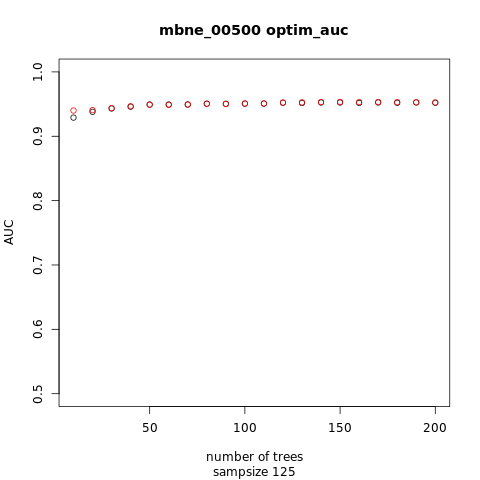
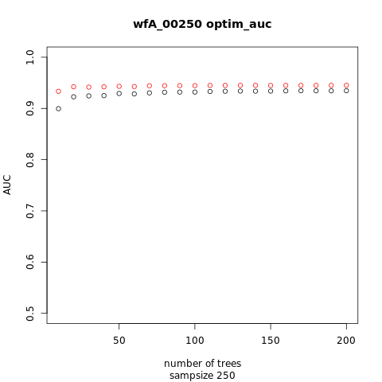
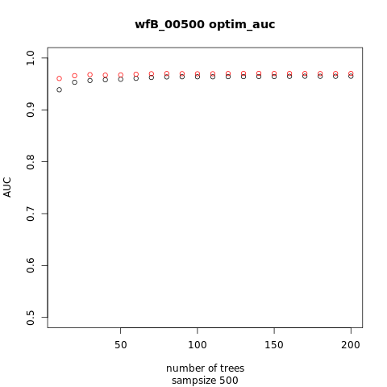
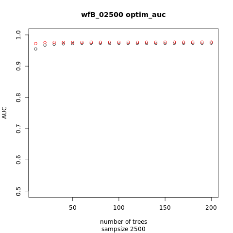
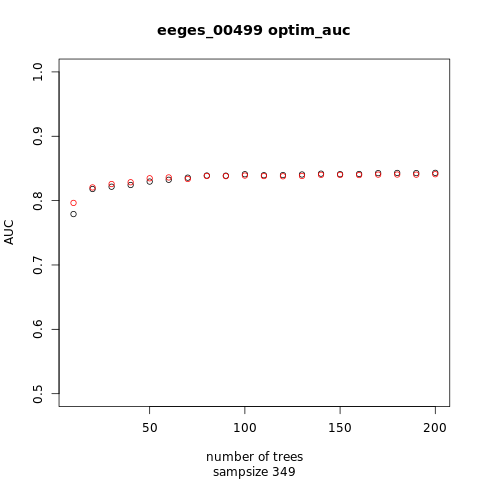
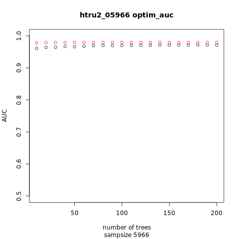

# Technical report
# Softening of trees in random forests

## Introduction

This report describes experiments with application of split softening[1]
to the trees in random forests[2] for classification problems with 2 classes.
To compare performance of the models we use the "Area under (ROC) curve" - AUC.
The values of AUC used in comparisons in this report are computed with the
"trapezoid method" using test sets.
Lets call the classes "positive" and "negative".

In the original design of random forests for classification the output of any tree
in the forest is a class label and the result from the forest is the prevailing
label over all trees.
For our purpose of AUC evaluation we need output of the forest in the form of "score" -
a comparable value (typically from the interval [0, 1]) which is higher when
the submitted case is more likely classified as "positive".
To achieve this we modify the way how the random forest model
produces the output for a data case:
Each tree provides its score which is 1 when it outputs label "positive"
and 0 when the output is label "negative".
These scodes are averaged over all trees to produce the forest score.
When trees in the forest are softened, the score from each tree is
in the interval [0, 1].

## Experimantal setup

Experiments are implemented in R with packages [randomForest](https://cran.r-project.org/web/packages/randomForest/)
and [SplitSoftening](https://cran.r-project.org/web/packages/SplitSoftening/).
With the package randomForest a forest with 200 trees is grown using a training set.
The trees from the forest are converted to the form used by the package SplitSoftening
and then a softening method is applied.
Values of AUC are computed with the test set using the forest before and after softening.

We want to observe results from non-softened and softened forests depending on
forest size (number of trees) and also how it is influenced by the parameter
"sampsize" which specifies the size of samples drawn (with replacement)
from the whole training set to grow each tree in the forest.
Thus from each training set we prepare forests with several values of the "sampsize" parameter.
To get results with various forest sizes *n*=10, 20, 30, ..., 200
we use for prediction only first *n* trees from the forest.

When applying a softening method to each tree in the forest, the whole training set
is used - the same set as used for training the forest.
Although each tree from the forest is grown with its own sample from this training set,
it does not make sense to use this sample for softening with optimization method,
because the trees in the random forest are grown to the maximal size, which means
that when the sample from the training set is evaluated with the tree,
all the cases are classified with no error
(to any leaf fall cases only from one class).
From this it follows, that "zero softening" - the softening which is equivalent
to non-soft tree -
is optimal for this sample of training cases.

We use the following data sets:
- [Magic Telescope](https://archive.ics.uci.edu/ml/datasets/magic+gamma+telescope)
- [MiniBooNE particle identification](https://archive.ics.uci.edu/ml/datasets/MiniBooNE+particle+identification)
- [Waveform](https://archive.ics.uci.edu/ml/datasets/Waveform+Database+Generator+(Version+1))
- [EEG Eye State](https://archive.ics.uci.edu/ml/datasets/EEG+Eye+State)
- [Electrical Grid Stability Simulated Data Data Set](https://archive.ics.uci.edu/ml/datasets/Electrical+Grid+Stability+Simulated+Data+)
- [HTRU2](https://archive.ics.uci.edu/ml/datasets/HTRU2)

The Waveform data set is originally a set with 3 classes.
For the purpose of our experiments we define two problems "wfA" and "wfB",
where "wfA" considers the first class from the original data set as the "signal" class
and the remaining classes as the "background";
the "wfB" consideres the second class as the "signal" and the rest as the "background".
We do not use the data set which has the third class as the "signal" because
it has the same probabilistic distribution as the "wfA" data set.

## Results

In the previous research of split softening in decision trees [1] we use two kinds of softening method:
- without optimization
- with optimization
In the first group the method called "DR1" is identified as the best
from the perspective of performance measured by AUC.
In the second group the method "optim_auc" is the winner;
it uses the Nelder-Mead optimization with the objective function
defined as the AUC computed from the training set.
We use the methods DR1 and optim_auc in our experiments with random forests.

The results are presented in graphs where x-axis is the forest size (number of trees),
y-axis represents AUC computed on the test set.
The main title of the graph contains the data set name, the size of the train set
and the softening method.
There is a subtitle with the value of the "sampsize" parameter.
In each graph there are results from the non-softened forest displayed as black points
and the results from the forest of softened trees as coloured points
(blue for DR1 softening, red for optim_auc).
Representative examples are presented below, more graphs can be found
for the DR1 method results in document [images_DR1.md](images_DR1.md)
and for results from the method optim_auc in document [images_optim_auc.md](images_optim_auc.md).

Using DR1 softening on random forests brings generally no improvement of AUC
on the data sets Magic Telescope and MiniBooNE.

With wfA data distribution the DR1 method improves AUC slightly,
namely when the training set is small,
with larger training sets the improvement is lower.
And the improvement obtained by softening
(difference of the AUC of softened forest and the AUC
of the same forest before softening)
grows with growing value of the parameter "sampsize".
This difference is also higher with very small forests
(number of trees <= 30).
The same can be said about wfB, but the effect of softening
is generally lower (and often there is no improvement of AUC).

With the EEG Eye State data ("eeges") the positive impact of softening (in the terms of AUC)
can be observed only with training set size 250.
Again, in this case the impact is higher with higher value of "sampsize".
With other (higher) sizes of training set forests softened with the DR1 method
have lower AUC than non-soft forests.

The Electrical Grid Stability distribution produced forests
which in our experiments were improved by softening if the training set
is smaller than 1333 cases.

With the HTRU2 data set we can see again the strongest positive effect of softening
on the smallest training set.
When the training set size grows, the AUC improvement obtained by softening diminishes
and on the training set of size 11932 there are results from the softened forests
worse than from the original non-soft forests.

The softening method "optim_auc" in our experiments provides results
very similar to the results from the method "DR1".
Although optimization of softening parametes is used in this method
to maximize the AUC on individual trees (evaluated using the training set),
the AUC on test set of the forest is higher than the AUC from the method "DR1"
on very few cases.
These cases fall into two groups:

- The forests where DR1 results are worse than results from the non-soft forest;
  in some of these situations the optim_auc results are better than DR1 results,
  but still worse than non-soft forest.

- The forests with very low number of trees (<=30).

------

-------

-------

-------

---

------

## Conclusion

When softening methods were used to trees in random forests and results
were compared by AUC, a positive effect of softening was observed in situations
where a training set was small.

In some cases the results of forests with softened trees were worse than results
of the original non-soft forests.

More sofisticated softening method optim_auc
seems to exceed both the simple method DR1 and no softening
only with very small forests.

## References

[1]: Dvořák, Jakub: *Classification trees with soft splits optimized for ranking*.
Computational Statistics (2019) 34:763–786.

[2]: Breiman, Leo: *Random Forests*. Machine Learning (2001) 1:5-32.

